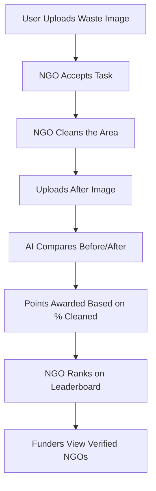

Absolutely, Meet! Here's a comprehensive **README.md** for your project **CleanQuest** — it's formatted for GitHub, includes everything from project overview to setup, workflow, tech stack, folder structure, and even contribution guidelines.

---

```markdown
# 🧼 CleanQuest

> **Crowdsourcing a Cleaner Tomorrow**
>
> A platform that empowers citizens to report waste sites, enables NGOs to take action, and leverages AI to verify impact. CleanQuest gamifies cleanup efforts, ranks NGOs on a public leaderboard, and lets funders support verified impact.

---

## 🌍 Project Overview

CleanQuest bridges the gap between community waste reporting and real-world cleanup efforts. Here's how it works:

1. **Citizens Upload Waste Images** 📸  
2. **NGOs Accept and Clean the Site** 🧹  
3. **AI Compares Before/After Photos** 🤖  
4. **NGOs Earn Points Based on Cleanup Quality** 🏆  
5. **Funders Support Verified NGOs** 💰  

---

## 🧩 Tech Stack

| Area              | Tech Used                        |
|-------------------|----------------------------------|
| Frontend          | Next.js 14 (App Router), TypeScript, Tailwind CSS |
| Backend           | Supabase (Postgres, Auth, Storage) |
| AI Cleanup Engine | Gemini Vision API (Image Diff)   |
| Hosting           | Vercel / Railway                 |
| CI/CD             | GitHub Actions                   |
| Payments (Future) | Razorpay / Stripe                |

---

## 🚀 Live Demo (Coming Soon)

- [Frontend](https://cleanquest.vercel.app)
- [Admin Panel](https://cleanquest.vercel.app/dashboard/admin)

---

## 📦 Folder Structure

```bash
/cleanquest
├── app
│   ├── layout.tsx                  # Global layout
│   ├── page.tsx                    # Landing page
│   ├── report/page.tsx             # Waste upload page
│   ├── dashboard/ngo/page.tsx      # NGO dashboard
│   ├── dashboard/admin/page.tsx    # Admin dashboard
│   ├── leaderboard/page.tsx        # Leaderboard
│   └── ngo/[id]/page.tsx           # NGO profile
├── components
│   ├── Hero.tsx
│   ├── ImageUploader.tsx
│   ├── TaskCard.tsx
│   ├── LeaderboardTable.tsx
│   ├── BeforeAfterSlider.tsx
│   ├── LocationPicker.tsx
│   └── ShareBadgeModal.tsx
├── lib
│   ├── supabaseClient.ts
│   └── ai.ts
├── styles
│   └── globals.css
├── public
│   └── logo.svg
├── tailwind.config.ts
├── tsconfig.json
└── package.json
```

---

## 🛠️ Setup Instructions

### 1. Clone the Repository

```bash
git clone https://github.com/your-username/cleanquest.git
cd cleanquest
```

### 2. Install Dependencies

```bash
bun install
# or
npm install
```

### 3. Environment Setup

Create a `.env.local` file:

```env
NEXT_PUBLIC_SUPABASE_URL=your-supabase-url
NEXT_PUBLIC_SUPABASE_ANON_KEY=your-anon-key
GEMINI_API_KEY=your-gemini-api-key
```

### 4. Start the Development Server

```bash
bun dev
# or
npm run dev
```

Visit `http://localhost:3000`

---

## 🧠 Workflow Overview



---

## 📈 Features Roadmap

- ✅ Image Upload + Location
- ✅ NGO Dashboard & Task Management
- ✅ AI Cleanup Detection (Gemini)
- ✅ Leaderboard & NGO Profiles
- ⏳ Donation Gateway Integration (Razorpay)
- ⏳ User Notification System
- ⏳ Admin Analytics Dashboard

---

## 🤝 Contributing

Want to help?

```bash
git checkout -b feature/my-feature
git commit -m "Add my feature"
git push origin feature/my-feature
```

Then open a pull request. All contributions welcome!

---

## 📄 License

This project is licensed under the [MIT License](LICENSE).

---

## 💡 Author

Made with ❤️ by [Meet Patel](https://github.com/meetpateldev)

> “Together, we can turn waste into opportunity.”

```

---

Let me know if you want me to:
- Generate a Figma-style visual flow
- Help build a Supabase schema for NGOs & Tasks
- Write a full API routes doc (REST or RPC style)

I’m here to help build this into something massive 🚀
